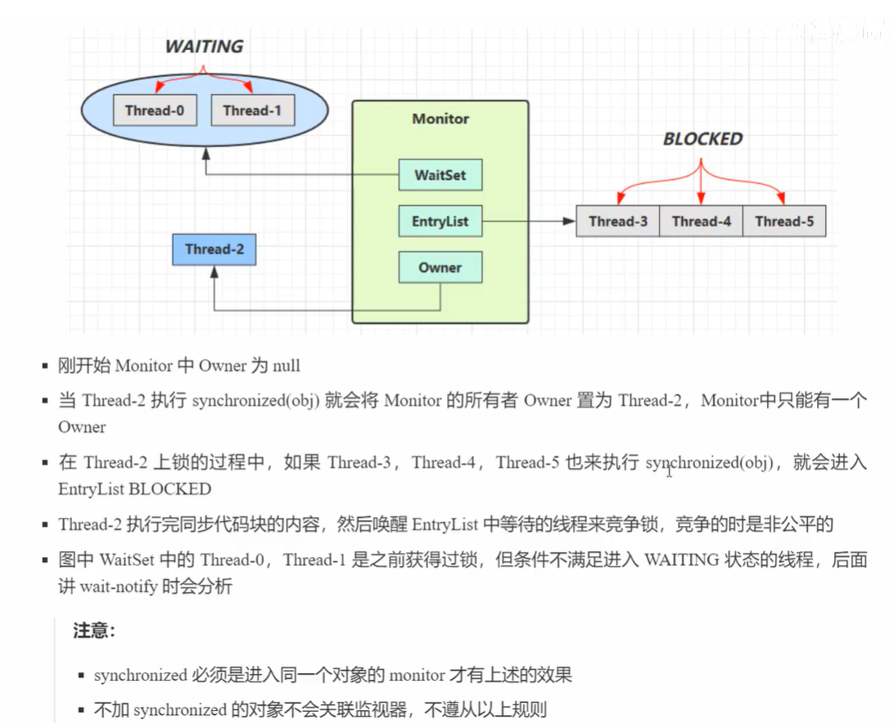
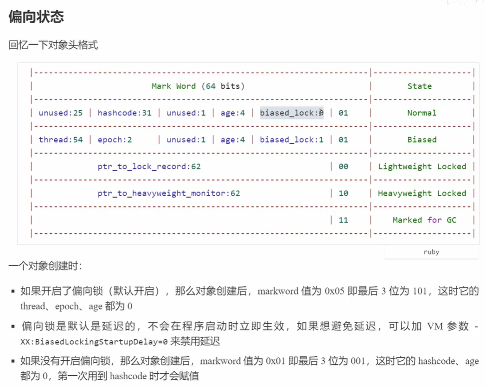

####并发编程笔记 
- Synchronized 
```html
  synchronized只能锁对象或类
  CAS自旋锁是为了避免线程阻塞-唤醒导致的线程切换带来的成本
```

  
  
- 禁用偏向锁
```html
对象的hashcode()方法会禁用偏向锁;
wait()、notify()
```
- 锁消除
```html
 java -Eliminate -jar... JIT自动解释优化
```
- 虚假唤醒
```html
解决方案
    - while循环
``` 
AQS 
- - - 
```html
可重入锁为什么可重入:
    int nextc = getState() + acquires; //acquires=1
    if (nextc < 0) // overflow
        throw new Error("Maximum lock count exceeded");
    setState(nextc);
``` 
```html
子类实现的模板方法tryAcquire()中：
    当需要排队等待时触发shouldParkAfterFailedAcquire
    在该方法中判断前一个节点的状态位（此状态位非同步器状态）
    if(SIGNAL) //唤醒 -1 -->当前线程需要park等待，等待前一个节点唤醒自己
    if(CANCEL) //取消 -->跳过前一个节点继续向前判断

parkAndCheckInterrupt方法中
  LockSupport.park(this); //暂停住，
  return Thread.interrupted();//清除中断标记，清除后park的线程还可以再次park,
                                否则LockSupport.park不会再生效
  
```