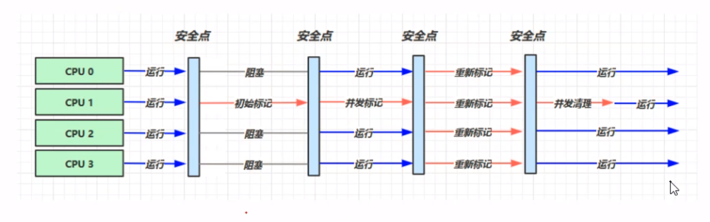

###性能调优
Jvm 内存模型


---
字符串池
```html
StringTable 串池的大小调优 如果字符串常量池比较大,
可通过-XX:StringTableSize=(1009,...)
```
- - -
禁用手动GC
```java
-XX:DisableExplicitGC(会影响直接内存的自动回收)
```
---
垃圾回收  
 - 栈上分配
   - 逃逸分析 -XX:+DoEscapeAnalysis
   - 标量分配 -XX:+EliminateAllocations
   
 - 可达性分析
    ```html
    dump文件 jmap -dump:format=b,live,file=x.bin pid
    -XX:+PrintGCDetails -verbose:gc
    GCROOT:
        {
            虚拟机栈(方法栈)中的参数、局部变量、临时变量等,
            方法区中引用到的静态变量,
            字符串池String Table,
            本地方法栈引用的对象,
            虚拟机内部基本类型对应的Class对象,常驻异常等,
            被synchronized锁持有的对象
            
        }
    ```
    
 - jvm参数
   ```html
   堆初始大小 -Xms
   堆最大大小 -Xmx 或 -XX:MaxHeapSize=size
   新生代大小 -Xmn 或 (-XX:NewSize=size + -XX:MaxNewSize=size )
   幸存区比例（动态） -XX:InitialSurvivorRatio=ratio 和 -XX:+UseAdaptiveSizePolicy
   幸存区比例 -XX:SurvivorRatio=ratio
   老年代-新生代比例:-XX:NewRatio
   晋升阈值 -XX:MaxTenuringThreshold=threshold
   晋升详情 -XX:+PrintTenuringDistribution
   GC详情 -XX:+PrintGCDetails -verbose:gc
   FullGC 前 MinorGC -XX:+ScavengeBeforeFullGC
   ```
   
 - 引用类型
   ```html
   SoftReference: 当没有强引用且垃圾回收内存不够时会被回收
   WeekReference: 当没有强引用且垃圾回收时会被回收
   虚引用: 一般指向本地内存，当本地内存无引用时，会被放入回收队列，
         由cleaner调用unsafe的freeMemory释放内存
   终结器引用:
   ```

- 垃圾回收算法

    ```html
    内存碎片:
     - 压缩式:不会产生内存碎片，分配新内存时采用指针碰撞方法
     - 非压缩式：会产生内存碎片，再分配对象空间采用空闲列表方法
    ```

    

 - 垃圾回收器
   ```html
   - 串行回收:单线程  -XX:+UseSerialGC=Serial+SerialOld
   - 并行回收:吞吐量优先 -XX:+UseParallelGC/-XX:+UseParallelOldGC
   - 响应时间优先
   CMS回收器:
     (新生代配合)-XX:+UseParNewGC -XX:+UseConcMarkSweepGC
     初始标记-->并发标记-->重新标记-->并发清除
   Garbage First收集器:
     跨代引用
   ```
   
   
 - 类加载阶段
   
   ```html
   加载-->链接(验证、准备(final常量会初始化)、解析)-->初始化
   ```
   