###性能调优
Jvm 内存模型
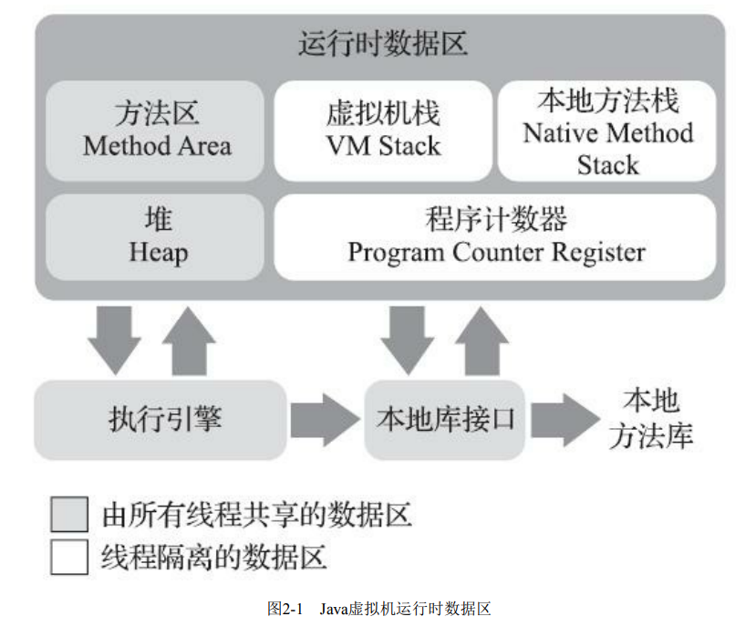

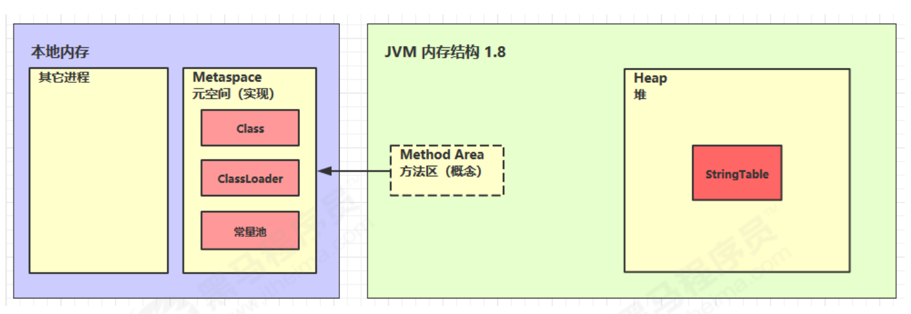
---
---
方法栈
```html
早期方法调用 编译期已知方法引用
晚期方法调用 动态虚方法引用
```
--- 
字符串池
```html
StringTable 串池的大小调优 如果字符串常量池比较大,
可通过-XX:StringTableSize=(1009,...)
```
- - -
禁用手动GC
```html
-XX:DisableExplicitGC(会影响直接内存的自动回收)
```
---
垃圾回收  
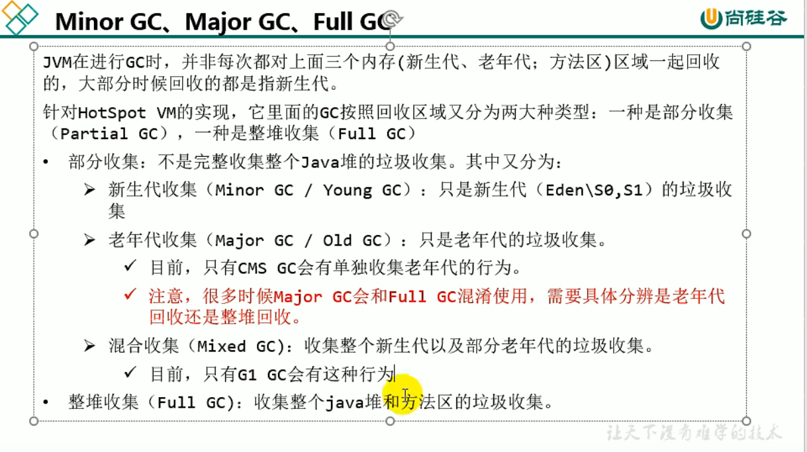 
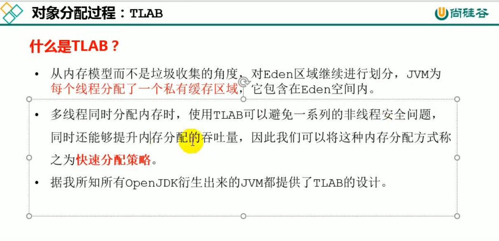
 - 栈上分配
   - 逃逸分析 -XX:+DoEscapeAnalysis
   - 标量分配 -XX:+EliminateAllocations
   
 - 可达性分析
    ```html
    dump文件 jmap -dump:format=b,live,file=x.bin pid
    -XX:+PrintGCDetails -verbose:gc
    GCROOT:
        {
            虚拟机栈(方法栈)中的参数、局部变量、临时变量等,
            方法区中引用到的静态变量,
            字符串池String Table,
            本地方法栈引用的对象,
            虚拟机内部基本类型对应的Class对象,常驻异常等,
            被synchronized锁持有的对象
            
        }
    ```
    
 - jvm参数
   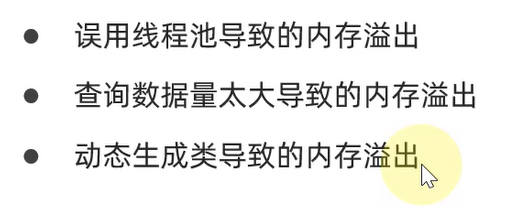
   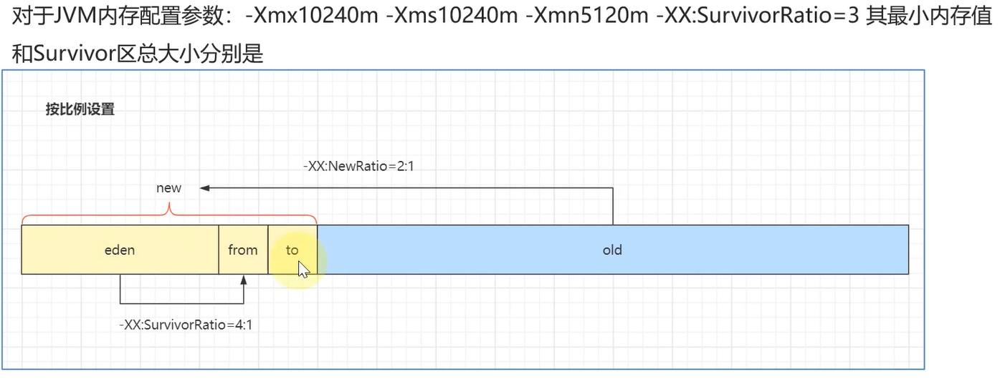
   ```html
   堆初始大小 -Xms
   堆最大大小 -Xmx 或 -XX:MaxHeapSize=size
   新生代大小 -Xmn 或 (-XX:NewSize=size + -XX:MaxNewSize=size )
   幸存区比例（动态） -XX:InitialSurvivorRatio=ratio 和 -XX:+UseAdaptiveSizePolicy
   幸存区比例 -XX:SurvivorRatio=ratio
   老年代-新生代比例:-XX:NewRatio
   晋升阈值 -XX:MaxTenuringThreshold=threshold
   晋升详情 -XX:+PrintTenuringDistribution
   GC详情 -XX:+PrintGCDetails -verbose:gc
   FullGC 前 MinorGC -XX:+ScavengeBeforeFullGC
   ``` 
   ```html
   配置jvm参数
   查看当前的参数: java -XX:+PrintFlagsFinal
   查看命令参数: java -XX:+PrintCommandLineFlags
   查看初始化参数： java -XX:+PrintFlagsInitial
   ```
   
 - 引用类型
   ```html
   SoftReference: 当没有强引用且垃圾回收内存不够时会被回收
   WeekReference: 当没有强引用且垃圾回收时会被回收
   虚引用: 一般指向本地内存，当本地内存无引用时，会被放入回收队列，
         由cleaner调用unsafe的freeMemory释放内存
   终结器引用:
   ```

 - 垃圾回收算法

     ```html
     内存碎片:
      - 压缩式:不会产生内存碎片，分配新内存时采用指针碰撞方法
      - 非压缩式：会产生内存碎片，再分配对象空间采用空闲列表方法
     回收策略比较:
         低延迟>吞吐量>内存占用
     出发FullGC的条件:
         - 老年代空间不足
         - 方法区空间不足
         - 显式调用System.gc()
         - Minor GC进入老年代的数据的平均大小>老年代可用内存
         - 大对象直接进入老年代而老年代的可用内存不足
     ```

    

 - 垃圾回收器
   
   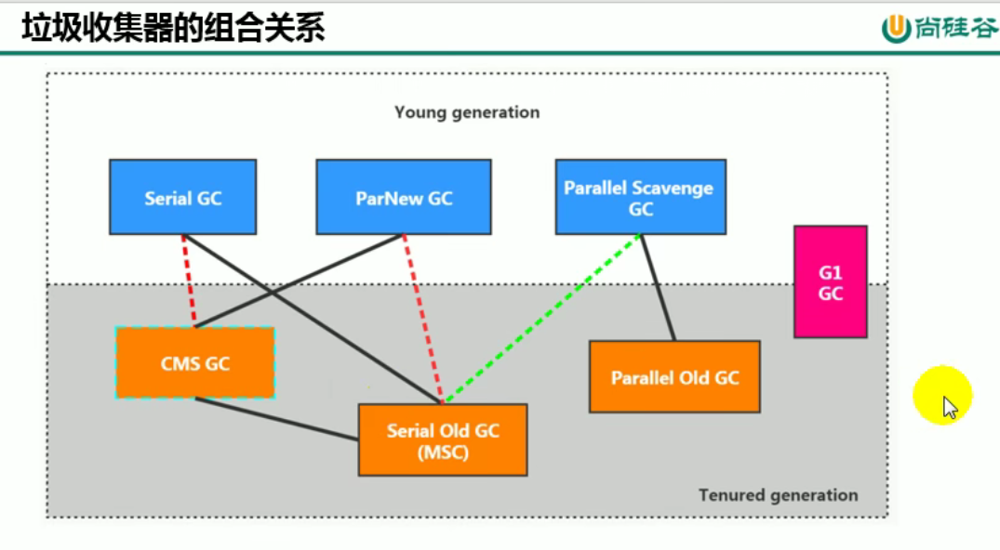
   
   ```html
   - 串行回收:单线程  -XX:+UseSerialGC=Serial+SerialOld
   - 并行回收:吞吐量优先 -XX:+UseParallelGC/-XX:+UseParallelOldGC
   - 响应时间优先
   CMS回收器:
     (新生代配合)-XX:+UseParNewGC -XX:+UseConcMarkSweepGC
     初始标记-->并发标记-->重新标记-->并发清除
   Garbage First收集器:
     跨代引用
     -XX:G1HeapRegionSize
         设置每个Region的大小，2的n次幂，默认是堆内存的1/2000
     -XX:MaxGCPauseMillis
         最大GC停顿时间，默认200ms
     -XX:ParallelGCThread
         STW时GC线程数的值，最多设置为8
     -XX:
   ```
   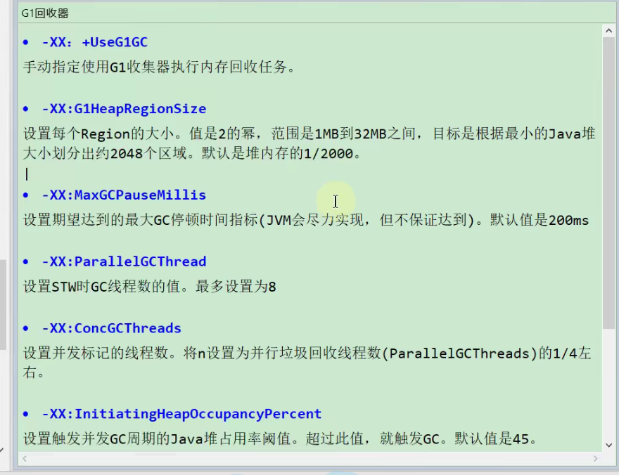
   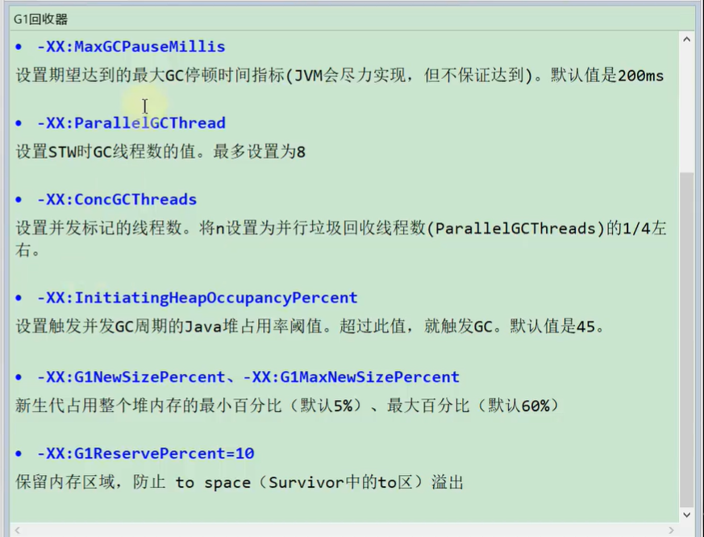
   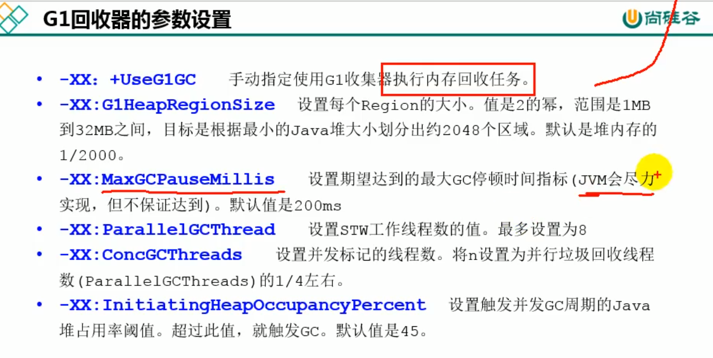
   
   
   
- 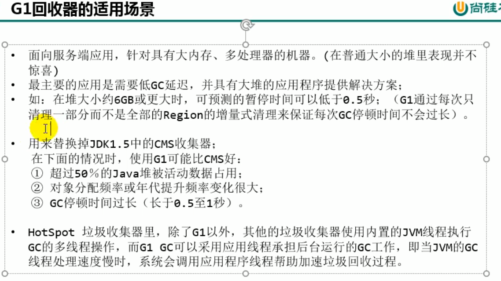

    

 - 类加载阶段
   
   ```html 
   加载-->链接(验证、准备(final常量会初始化)、解析)-->初始化 
   加载 
      -- Bootstrap,Extend Classloader,Application ClassLoader
   链接
      -- 验证，准备，解析
   ```
   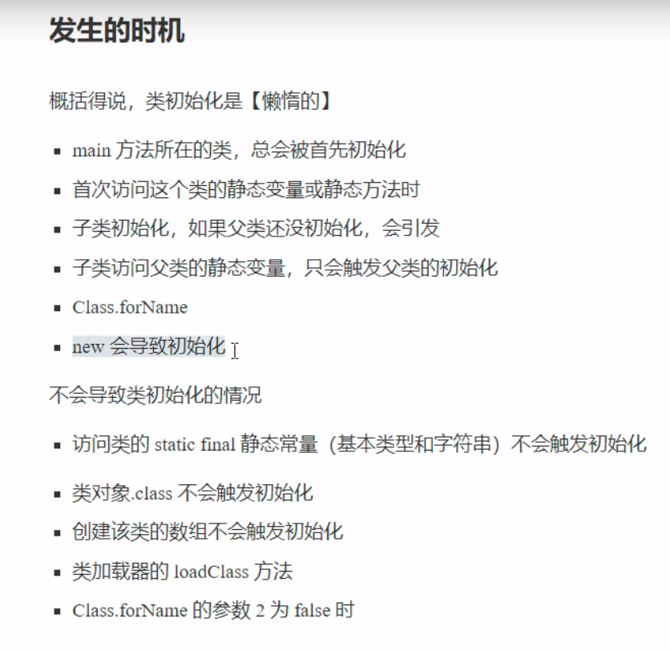
 
   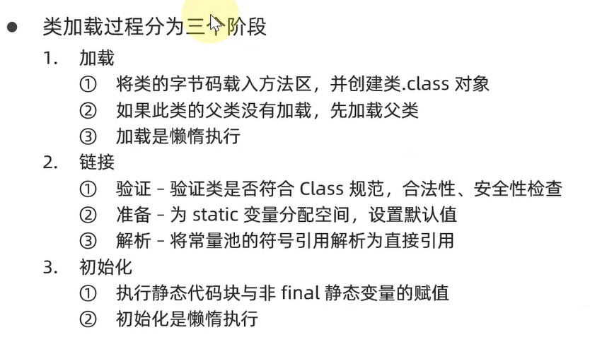

 - 内存泄露常见场景
   ```html
   - 类级别的静态集合类
   - 单例模式对象持有外部对象
   - 外部对象引用内部类
   - IO连接未正常关闭
   - 不合理作用域
   - HashSet改变hash值
   - Map缓存泄露(改用WeekHashMap)
   ``` 
 - 代码编写优化准则 
   ```html
   - 善用jvm的逃逸分析，变量作用域内使用完以后置为null利于GC
   - 利用逃逸分析的栈上分配
   - 
   ```